# agrun.js Flowchart

Last reviewed: 2026-05-13

Audience: end users, Web UI integrators, and new engineers who want to understand what agrun does before reading source code.

## One Sentence

agrun.js is a browser-first agent harness runtime: the host UI sends a user request, agrun builds structured context, an AI planner chooses tools or skills, the runtime executes only allowed actions, every step becomes observable state, and the host renders the final result or approval/error state.

## Latest System Development Principles Applied

These principles are based on current agent engineering guidance checked on 2026-05-13:

- OpenAI agent guidance: agent systems are built from model choice, tools, instructions, orchestration loops, and layered guardrails.
- AWS agentic AI guidance: trusted autonomy needs identity, guardrails, observability, auditability, and runtime controls.
- DORA continuous delivery guidance: high-quality systems stay deployable through automation, testing, observability, security, and low-risk change flow.

How agrun maps those principles:

| Principle | agrun meaning | Main code/docs |
|---|---|---|
| AI-first decision ownership | Runtime exposes contracts, tools, observations, and quality signals. AI/skills decide user-facing work and prose. | `src/runtime/action-loop-session-loop.js`, `agrun_docs/architecture-ssot.md` |
| Harness, not hardcode | Runtime should not special-case client topics or write brittle lexical answer rules. It should provide reusable gates and state. | `agrun_docs/architecture-ssot.md`, `src/runtime/planner-prompt.js` |
| Tool/provider separation | Host owns provider keys/endpoints. Runtime normalizes OpenAI/Gemini calls and exposes tools through an action registry. | `src/runtime/provider.js`, `src/runtime/action-registry.js` |
| Observable by default | Every run returns `steps`, `runState`, OODAE phase data, diagnostics, and result metadata for inspectors. | `src/runtime/result.js`, `agrun_docs/result-schema.md` |
| Policy at action boundary | Tool policies are allow/ask/deny by action and tier. Approval can block and resume a run. | `src/runtime/policy.js`, `agrun_docs/webui-integration-contract.md` |
| Durable context | Sessions persist messages, memory, thread routing, compaction, and TodoState across turns. | `src/session/handle.js`, `src/session/store.js` |
| Verify source to dist | Source is the SSOT; build produces browser-ready `dist/`; tests and dist checks protect regressions. | `README.md`, `build/usage-doc-plugin.cjs` |

External references:

- [OpenAI: A practical guide to building agents](https://cdn.openai.com/business-guides-and-resources/a-practical-guide-to-building-agents.pdf)
- [AWS Prescriptive Guidance: Build trust through identity, guardrails, and observability](https://docs.aws.amazon.com/prescriptive-guidance/latest/strategy-operationalizing-agentic-ai/focus-areas-trust.html)
- [DORA: Continuous delivery capability](https://dora.dev/capabilities/continuous-delivery/)

## Chart 1: Whole System Big Picture

```mermaid
flowchart TD
  subgraph BuildDist["Source, Build, And Distribution"]
    Source["src/ runtime source"]
    Docs["README / FLOWCHART / agrun_docs"]
    Rollup["rollup build:lib"]
    Vite["browser example build"]
    CopyExample["copy-browser-dist secret guard"]
    Dist["dist/agrun.js + dist/FLOWCHART.md + dist/agrun_docs + dist/example"]
  end

  subgraph Host["Host Product Surface"]
    User["End user"]
    HostUI["Web UI / chatbox"]
    HostSettings["Provider, model, endpoints, auth mode"]
    HostHooks["onStep / onToken / onPlannerDecision / onToolResult / onBeforeFinalize"]
    AbortSignal["abortSignal"]
    ApprovalUI["Approval UI"]
    InspectorUI["Inspector, Debug Report, Support Bundle"]
  end

  subgraph RuntimeSetup["Runtime Creation And Config"]
    CreateRuntime["createRuntime(options)"]
    NormalizeConfig["normalizeRuntimeConfig"]
    SkillSet["legacy skills array validation"]
    AgentSkillIndex["agentSkillIndexProvider + manifests + Top-K ranking"]
    RoleConfig["agent role / system prompt"]
    Stores["memory store + session store"]
    Policies["actionPolicy + skillPolicy + disabledActions"]
    AdvancedConfig["plannerMode, nativeToolsFailurePolicy, selfCorrection, circuitBreaker, costPricing"]
    DefaultRunOptions["defaultRunOptions"]
    PublicGetters["getState / getMemory / getRuntimeConfig / getActionRegistry"]
  end

  subgraph SessionLayer["Session, Thread, And Context Harness"]
    RunEntry["runtime.run or session.run"]
    MergeRunOptions["merge defaultRunOptions + per-run options"]
    ApprovalInput{"approval_resolution input?"}
    PersistUser["append pending user message"]
    ThreadIntent["extract / classify turn intent"]
    ThreadRouter["routeTopic + thread hydration"]
    SessionContext["prepare provider session context"]
    Compaction["compaction window + context snapshot"]
    SessionMemory["session memory"]
    GlobalMemory["global memory recall / promotion"]
    RunId["CAS run-N id generator"]
    ScopedState["thread-scoped TodoState + research slice + evidence URLs"]
  end

  subgraph RunLoopLayer["runLoop Routing"]
    NormalizeInput["normalizeInput"]
    CallerAbort["caller abort fast-fail"]
    RunLoop["runLoop"]
    ApprovalRoute{"approval_resolution?"}
    ProviderRoute{"tool-loop provider request?"}
    DirectSkillRoute{"direct skill canHandle?"}
    SkillLoop["runSkillLoop: canHandle, orient, execute, evaluate"]
    ProviderInputFailure["provider input failure result"]
    ActionLoop["runActionLoop"]
  end

  subgraph ActionSession["Action Loop Session State"]
    CreateActionSession["createActionLoopSession"]
    RunState["createRunState + hydrateRunStateWithThread"]
    PushStep["pushStep -> runtime events, metrics, step snapshots"]
    CostLedger["cost ledger"]
    ActionRegistry["createActionRegistry SSOT"]
    AvailableActions["filterAvailableActions + disabledActions"]
    VirtualWorkspaceEnsure["ensureVirtualWorkspace"]
    GoalAnchor["captureOriginalQuery + goal anchor"]
    SessionBudget["session budget, fingerprints, maxSteps"]
  end

  subgraph PlannerLoop["Planner And OODAE Loop"]
    OODAE["OODAE: observe, orient, decide, act, evaluate"]
    TodoAutostart["Todo autopilot autostart / plan-required / inspect-loop guards"]
    PlannerPrompt["planner prompt: state + tools + observations + directives"]
    PlannerMode["resolve native_tools or envelope"]
    NativeTools["native tool schemas for OpenAI / Gemini"]
    EnvelopeMode["JSON envelope prompt"]
    ProviderAdapter["OpenAI / Gemini provider adapter"]
    CircuitBreaker["provider timeout, retry, circuit breaker"]
    LLM["LLM response"]
    PlannerRepair["parse, repair, invalid-output hook, fallback budget"]
    Decision{"planner decision"}
  end

  subgraph PlanPath["Plan Decision Path"]
    PlanValidate["validatePlan"]
    PlanParallel["runPlanActions with max parallel"]
    PlanPartial["partial_ok handling"]
    PlanSynthesize["synthesize_per_action / plan_synthesize"]
    PlanObservation["plan result observation"]
  end

  subgraph Gates["Validation, Policy, And Human Control"]
    DecisionAvailability["action availability check"]
    ArgsValidation["validateActionArgs + alias rewrite"]
    Preflight["action preflight"]
    SelfCorrection["selfCorrection retry observation"]
    ActionPolicyGate{"actionPolicy allow / ask / deny"}
    SkillPolicyGate{"skillPolicy allow / ask / deny"}
    PendingApproval["pendingApproval + signed resumeToken"]
    ApprovalResume["runApprovalResolution"]
    Denied["blocked / denied result"]
  end

  subgraph Actions["Action Registry Capabilities"]
    ActionDispatch["dispatch selected action"]
    SkillCatalog["list_agent_skills / read_agent_skill / use_agent_skill"]
    SkillTool["execute_skill_tool"]
    WebSearch["web_search"]
    ReadUrl["read_url"]
    TodoActions["todo_plan / advance / cancel / run_next / inspect"]
    WorkspaceActions["workspace list/read/write/replace/append/insert/remove/finalize/publish"]
    RepoActions["optional repo_rg / repo_read_file"]
    Clarify["ask_clarification"]
  end

  subgraph WorkState["Mutable Run Work State"]
    AgentSkillContext["agentSkillContext: active/last-read/catalog"]
    ToolContext["toolContext: lastResult + history"]
    ResearchContext["researchContext: search passes, ranked results, readSources"]
    ResearchState["researchState + quality gate signals"]
    EvidenceGraph["researchEvidenceGraph + reportLoop + researchWorkspace"]
    TodoState["TodoState + terminal observation"]
    VirtualWorkspace["virtualWorkspace draft files + final candidate"]
    InquiryContext["inquiry / clarification context"]
    FailureSignals["failedTools, actionFailureSignal, recoveryState, publishBlockSignal"]
  end

  subgraph Terminal["Terminal And Result Normalization"]
    DirectFinal["direct_final from skill tool"]
    PlannerFinal["planner_final"]
    PlannerFinalize["planner_finalize -> runtime finalizer provider call"]
    WorkspacePublish["workspace_publish_candidate direct terminal"]
    ReadinessContract["AI finalReadiness observation + continuation/conflict signals"]
    TerminalContract["terminal final contract"]
    SourceNormalize["source/citation normalization + final response structure"]
    QualitySignals["final response quality signals"]
    FinishRun["finishRun + finalizeResult"]
    Failure["structured failure / maxSteps / provider error"]
    Result["canonical result: output, error, steps, runState, diagnostics"]
  end

  subgraph PersistUI["Persistence And UI Consumption"]
    HostRender["render answer / approval / failure"]
    Activity["derive activity from steps"]
    PersistAssistant["append assistant message"]
    PersistMemory["append session memory + promote global memory"]
    PersistThread["persist thread TodoState + research slice"]
    Usage["token usage + lastRun"]
  end

  Source --> Rollup
  Docs --> Rollup
  Rollup --> Dist
  Vite --> CopyExample
  CopyExample --> Dist
  Dist --> HostUI
  Dist --> InspectorUI

  User --> HostUI
  HostUI --> RunEntry
  HostSettings --> CreateRuntime
  HostHooks --> DefaultRunOptions
  AbortSignal --> MergeRunOptions
  CreateRuntime --> NormalizeConfig
  NormalizeConfig --> SkillSet
  NormalizeConfig --> AgentSkillIndex
  NormalizeConfig --> RoleConfig
  NormalizeConfig --> Stores
  NormalizeConfig --> Policies
  NormalizeConfig --> AdvancedConfig
  NormalizeConfig --> DefaultRunOptions
  PublicGetters --> InspectorUI

  RunEntry --> MergeRunOptions
  MergeRunOptions --> ApprovalInput
  ApprovalInput -- yes --> ApprovalResume
  ApprovalInput -- no --> PersistUser
  PersistUser --> ThreadIntent
  ThreadIntent --> ThreadRouter
  ThreadRouter --> ScopedState
  ThreadRouter --> SessionContext
  SessionContext --> Compaction
  Compaction --> SessionMemory
  GlobalMemory --> SessionMemory
  SessionMemory --> RunId
  ScopedState --> RunId
  RunId --> NormalizeInput

  NormalizeInput --> CallerAbort
  CallerAbort --> RunLoop
  RunLoop --> ApprovalRoute
  ApprovalRoute -- yes --> ApprovalResume
  ApprovalRoute -- no --> ProviderRoute
  ProviderRoute -- no --> SkillLoop
  ProviderRoute -- yes --> DirectSkillRoute
  DirectSkillRoute -- yes --> SkillLoop
  DirectSkillRoute -- no --> ActionLoop
  RunLoop --> ProviderInputFailure

  ActionLoop --> CreateActionSession
  CreateActionSession --> RunState
  CreateActionSession --> PushStep
  CreateActionSession --> CostLedger
  CreateActionSession --> ActionRegistry
  CreateActionSession --> AvailableActions
  CreateActionSession --> VirtualWorkspaceEnsure
  CreateActionSession --> GoalAnchor
  CreateActionSession --> SessionBudget

  RunState --> OODAE
  ActionRegistry --> PlannerPrompt
  AvailableActions --> PlannerPrompt
  RoleConfig --> PlannerPrompt
  GoalAnchor --> PlannerPrompt
  ToolContext --> PlannerPrompt
  ResearchContext --> PlannerPrompt
  ResearchState --> PlannerPrompt
  EvidenceGraph --> PlannerPrompt
  TodoState --> PlannerPrompt
  VirtualWorkspace --> PlannerPrompt
  FailureSignals --> PlannerPrompt
  TodoAutostart --> PlannerPrompt
  OODAE --> PlannerPrompt
  PlannerPrompt --> PlannerMode
  PlannerMode -- native_tools --> NativeTools
  PlannerMode -- envelope --> EnvelopeMode
  NativeTools --> ProviderAdapter
  EnvelopeMode --> ProviderAdapter
  ProviderAdapter --> CircuitBreaker
  CircuitBreaker --> LLM
  LLM --> PlannerRepair
  PlannerRepair --> Decision

  Decision -- final --> PlannerFinal
  Decision -- finalize --> PlannerFinalize
  Decision -- plan --> PlanValidate
  Decision -- clarify --> Clarify
  Decision -- action --> DecisionAvailability
  PlanValidate --> PlanParallel
  PlanParallel --> PlanPartial
  PlanPartial --> PlanSynthesize
  PlanSynthesize --> PlanObservation
  PlanObservation --> OODAE
  PlanParallel --> WorkState

  DecisionAvailability --> ActionPolicyGate
  ActionPolicyGate -- ask --> PendingApproval
  ActionPolicyGate -- deny --> Denied
  ActionPolicyGate -- allow --> SkillPolicyGate
  SkillPolicyGate -- ask --> PendingApproval
  SkillPolicyGate -- deny --> Denied
  SkillPolicyGate -- allow --> ArgsValidation
  ArgsValidation --> Preflight
  Preflight --> SelfCorrection
  SelfCorrection -- retry observation --> OODAE
  SelfCorrection -- execute --> ActionDispatch
  PendingApproval --> ApprovalUI
  ApprovalUI --> ApprovalResume
  ApprovalResume --> RunLoop

  ActionDispatch --> SkillCatalog
  ActionDispatch --> SkillTool
  ActionDispatch --> WebSearch
  ActionDispatch --> ReadUrl
  ActionDispatch --> TodoActions
  ActionDispatch --> WorkspaceActions
  ActionDispatch --> RepoActions
  ActionDispatch --> Clarify

  SkillCatalog --> AgentSkillContext
  SkillTool --> ToolContext
  WebSearch --> ResearchContext
  ReadUrl --> ResearchContext
  ResearchContext --> ResearchState
  ResearchState --> EvidenceGraph
  TodoActions --> TodoState
  WorkspaceActions --> VirtualWorkspace
  RepoActions --> ToolContext
  Clarify --> InquiryContext
  WebSearch --> FailureSignals
  ReadUrl --> FailureSignals
  WorkspaceActions --> FailureSignals

  AgentSkillContext --> OODAE
  ToolContext --> OODAE
  ResearchContext --> OODAE
  ResearchState --> OODAE
  EvidenceGraph --> OODAE
  TodoState --> OODAE
  VirtualWorkspace --> OODAE
  InquiryContext --> OODAE
  FailureSignals --> OODAE

  OODAE -- continue --> PlannerPrompt
  SkillLoop --> FinishRun
  PlannerFinal --> ReadinessContract
  PlannerFinalize --> ReadinessContract
  PlanSynthesize --> ReadinessContract
  WorkspaceActions --> WorkspacePublish
  SkillTool --> DirectFinal
  ReadinessContract --> TerminalContract
  DirectFinal --> TerminalContract
  WorkspacePublish --> TerminalContract
  TerminalContract --> SourceNormalize
  SourceNormalize --> QualitySignals
  QualitySignals --> FinishRun
  Failure --> FinishRun
  Denied --> FinishRun
  ProviderInputFailure --> FinishRun
  FinishRun --> Result

  Result --> HostRender
  Result --> Activity
  Result --> InspectorUI
  Result --> PersistAssistant
  Result --> PersistMemory
  Result --> PersistThread
  Result --> Usage
  PersistAssistant --> Stores
  PersistMemory --> SessionMemory
  PersistThread --> ScopedState
  Usage --> Stores
  Activity --> InspectorUI
  HostRender --> User
```

How to read this chart:

1. Start at build/distribution: source, docs, Rollup, Vite, and copy-browser-dist produce the committed `dist/` package.
2. The host owns product UI, provider/auth settings, approval UI, abort signals, and optional hooks.
3. `createRuntime()` normalizes skills, agent skill index, policies, stores, planner mode, circuit breaker, cost pricing, Todo/workspace config, and default run options.
4. Session turns merge default/per-run options, route threads, compact context, recall memory, hydrate Todo/research state, and claim a durable `run-N` id.
5. `runLoop()` routes approval resumes, non-provider/direct-skill requests, provider input failures, or the AI action loop.
6. The action loop builds `runState`, runtime events, action registry, available actions, virtual workspace, goal anchor, cost ledger, and session budget before every OODAE planner cycle.
7. The planner may use native provider tools or envelope JSON; invalid output is repaired or surfaced as structured observation, not hidden runtime policy.
8. Before execution, actions pass availability, action policy, skill policy, argument validation, preflight, and optional self-correction.
9. Actions update work state: skills, tool results, research evidence, TodoState, virtual workspace, inquiry context, failure signals, and OODAE trace.
10. Terminal paths normalize final text through readiness signals, terminal contract, source/citation handling, quality signals, `finishRun`, and session/global persistence.

The rest of this document expands the big chart into smaller focused charts.

## Chart 2: Runtime Creation And Public API

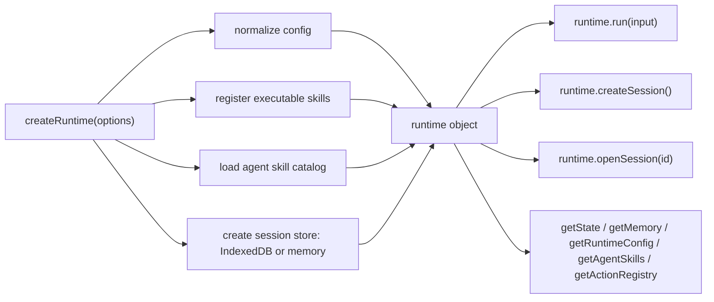

User-facing meaning:

- `createRuntime()` is the setup point.
- `runtime.run()` is the one-turn simple API.
- `runtime.createSession()` and `runtime.openSession()` are for multi-turn chat.
- Inspector/debug tools should use the read-only getters and result envelope instead of guessing hidden runtime state.

## Chart 3: Session Run Flow

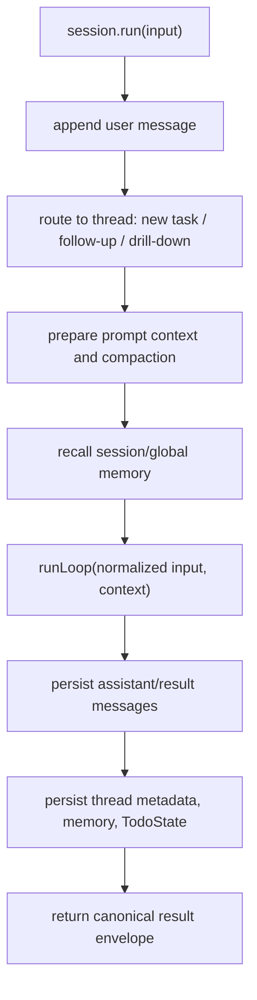

Important detail:

- Session logic is not just chat history.
- It protects long-running work from losing context by keeping thread identity, summaries, memory entries, and per-thread TodoState.

## Chart 4: runLoop Route Decision

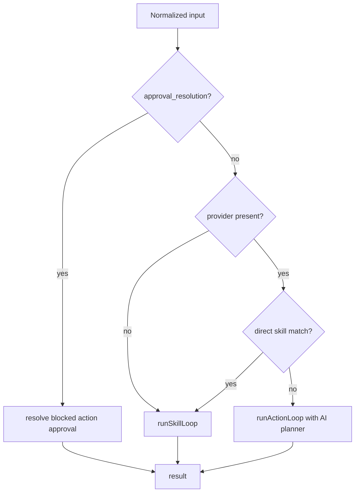

Current code fact:

- `src/runtime/run-loop.js` is the route switch.
- Provider-less or direct-skill turns use the skill loop.
- Provider-backed general agent turns use the action loop.
- Approval resume is a first-class input path, not a UI-only workaround.

## Chart 5: OODAE Action Loop

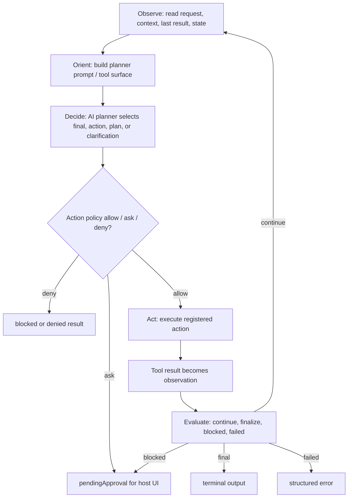

Why this matters:

- The runtime does not need to know the business topic.
- It provides a repeatable loop: observe, orient, decide, act, evaluate.
- Failures, blocks, and weak readiness become structured signals the UI and AI can see.

## Chart 6: Planner Action Surface

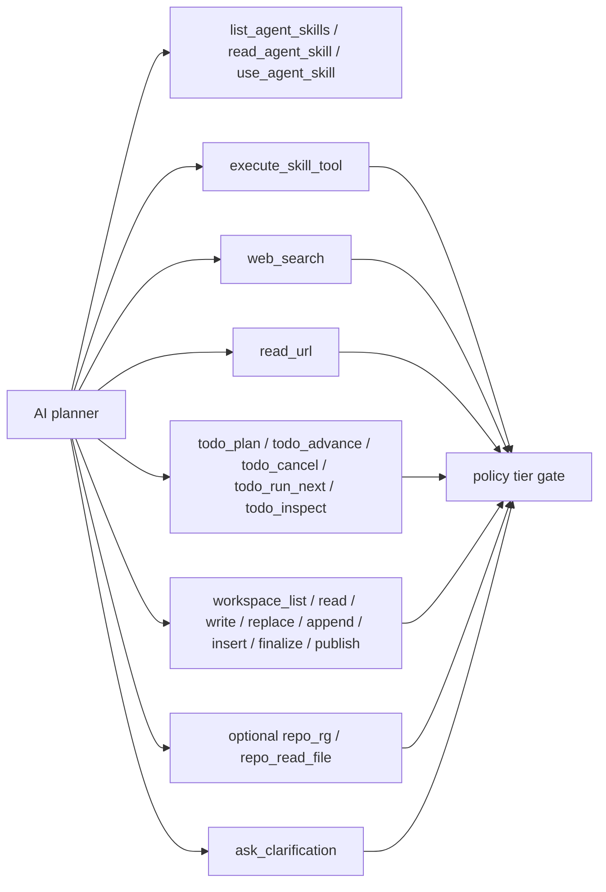

Action design:

- The action registry is the SSOT for planner-visible tools.
- Tools are described with name, schema, guidance, tier, and executor.
- Tier 0 defaults to allow, tier 1/2 defaults to ask, tier 3 defaults to deny unless overridden.

## Chart 7: Virtual Workspace For Long Answers

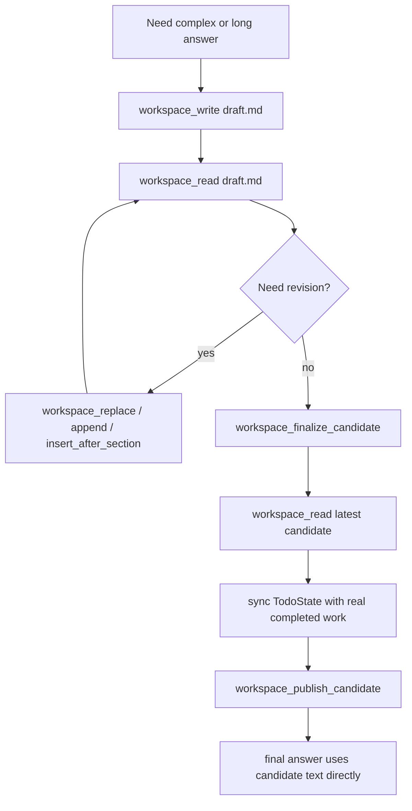

End-user meaning:

- For long reports, agrun can let AI draft into a browser-safe virtual workspace.
- The workspace never writes real local files.
- `workspace_publish_candidate` is the path that avoids the finalizer LLM shortening or rewriting the selected candidate.
- Runtime checks protocol facts like "was it finalized after latest write?" and "was it read after latest change?", but it does not hardcode answer quality by topic.

## Chart 8: TodoState And Progress

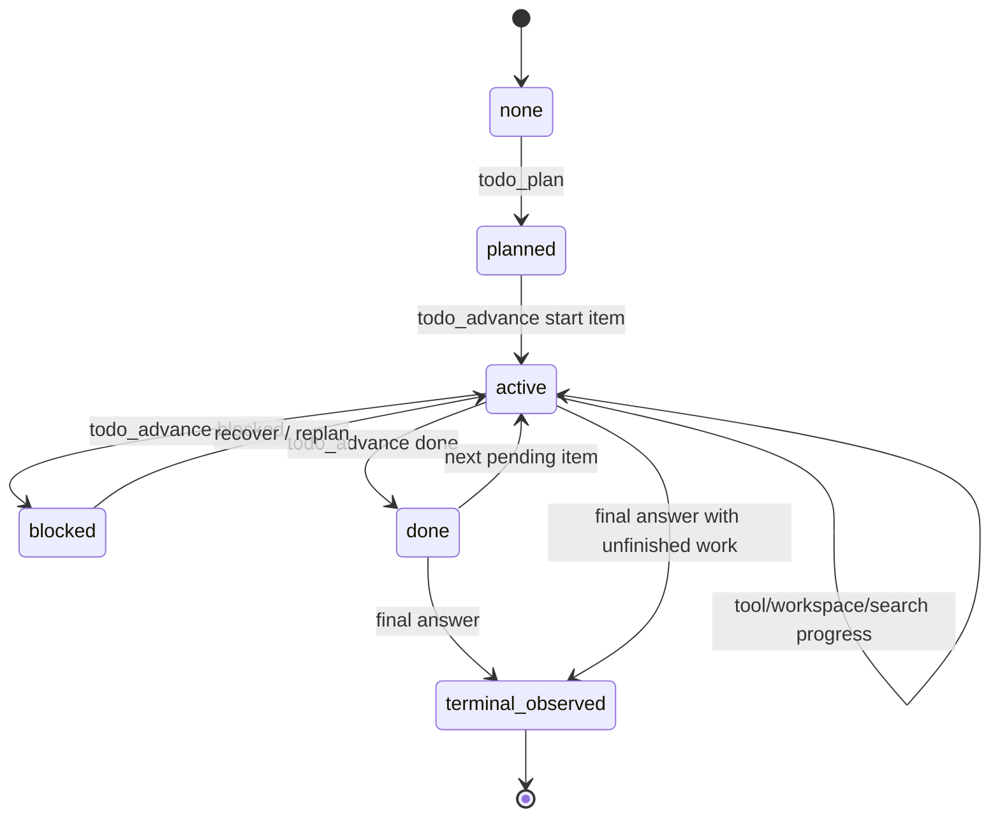

Important rule:

- TodoState is an audit/progress contract.
- Runtime should not fake unfinished tasks as done at terminal.
- If AI finalizes early, the Inspector should show stale or unfinished TodoState instead of hiding the issue.

## Chart 9: Result And UI Consumption

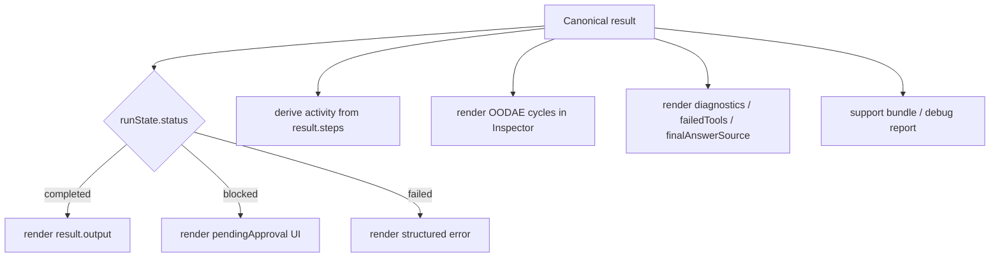

Host integration rule:

- UI should not collapse blocked and failed into the same state.
- `result.steps` and `runState` are the source for activity and inspector views.
- `phase` and OODAE are useful for debug, but normal UI should mainly follow `completed`, `blocked`, or `failed`.

## Chart 10: AI-First Harness Boundary

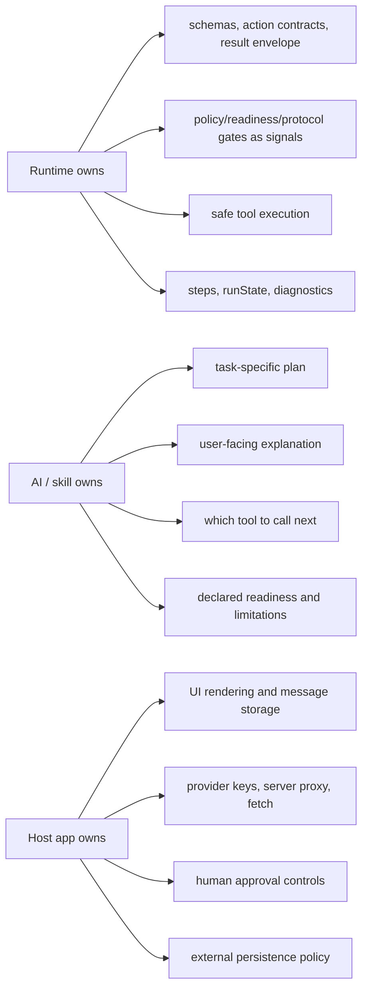

This is the main mental model:

- Runtime owns the harness.
- AI owns the work decision.
- Host owns UI, auth, and product integration.
- If a bug is "the AI answered too weakly", the best harness fix is usually better observable contracts, skill workflow, or verifier feedback, not a hidden hardcoded answer rule.

## Chart 11: Planner Native Tools And Envelope Fallback

```mermaid
sequenceDiagram
  autonumber
  participant Loop as Action loop
  participant Prompt as Planner prompt builder
  participant Mode as Planner mode resolver
  participant Provider as Provider adapter
  participant Model as AI model
  participant Repair as Parse / repair cascade
  participant Hooks as Host hooks

  Loop->>Prompt: collect request, context, tools, observations, directives
  Prompt->>Prompt: project runState, TodoState, research, workspace, failures
  Prompt->>Mode: resolve plannerMode and provider support
  alt native_tools available
    Mode->>Provider: send native tool schemas
    Provider->>Model: model chooses final_answer or action tool call
  else envelope mode
    Mode->>Provider: send JSON envelope instructions
    Provider->>Model: model returns planner envelope text
  end
  Model-->>Provider: response, usage, tool call or envelope
  Provider-->>Repair: normalized planner payload
  alt valid planner decision
    Repair-->>Loop: final / action / plan / clarify / finalize
  else invalid output
    Repair->>Hooks: onInvalidPlannerOutput if configured
    alt hook recovers
      Hooks-->>Loop: recovered planner decision
    else repair budget remains
      Repair->>Provider: repair prompt with original failure
      Provider->>Model: repaired response
      Model-->>Repair: repaired payload
    else no safe recovery
      Repair-->>Loop: structured invalid-output observation or failure
    end
  end
```

Why this chart exists:

- The planner is AI-first, but not uncontrolled.
- Runtime owns prompt projection, tool schemas, parse/repair, failure observations, and host hooks.
- The model owns the next decision: final, action, plan, clarify, or finalize.

## Chart 12: Policy, Approval, And Resume Flow

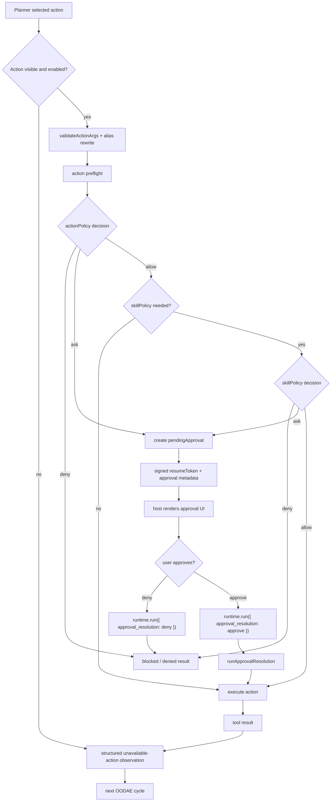

Important behavior:

- Approval is part of runtime input/output, not only a UI modal.
- The host controls the user interaction; agrun controls signed resume metadata and execution continuity.
- Deny/ask/allow are observable control states, so the Inspector can explain why a tool did or did not run.

## Chart 13: Terminal Finalizer And Result Contract

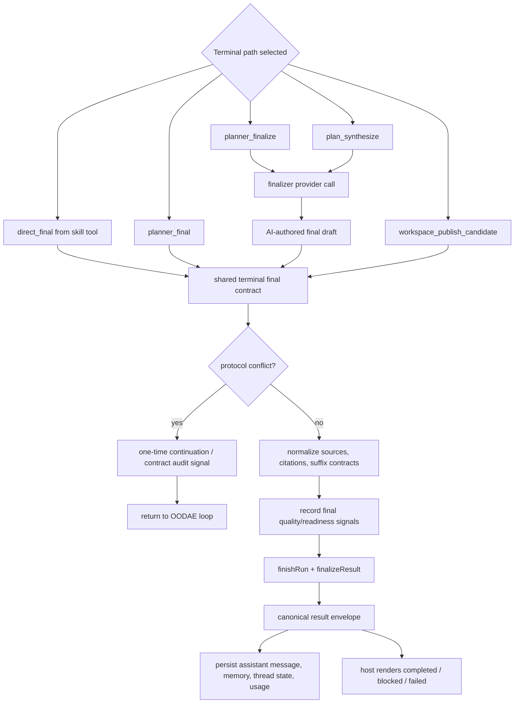

Key contract:

- Finalization should normalize structure and protocol facts.
- Runtime should not secretly rewrite weak content into a better-looking answer.
- If AI readiness conflicts with observed protocol facts, agrun should surface the conflict as a signal or continuation path.

## Source Reading Map

Start here if you want to inspect the code after reading the charts:

| Area | File |
|---|---|
| Runtime API | `src/runtime/runtime.js` |
| Route decision | `src/runtime/run-loop.js` |
| Main action loop | `src/runtime/action-loop-session-loop.js` |
| Planner | `src/runtime/planner.js` |
| Provider adapters | `src/runtime/provider.js` |
| Action registry | `src/runtime/action-registry.js` |
| Policy | `src/runtime/policy.js` |
| Result envelope | `src/runtime/result.js` |
| Session run | `src/session/handle.js` |
| Session storage | `src/session/store.js` |
| Virtual workspace actions | `src/runtime/actions/virtual-workspace-actions.js` |
| Todo actions | `src/runtime/actions/todo-actions.js` |
| Public runtime docs | `agrun_docs/public-runtime-api.md` |
| Result schema docs | `agrun_docs/result-schema.md` |
| Web UI contract docs | `agrun_docs/webui-integration-contract.md` |
| Architecture SSOT | `agrun_docs/architecture-ssot.md` |

## Practical Reading Order

1. Read Chart 1 and Chart 10 to understand the boundary between host, runtime, and AI.
2. Read Chart 4 and Chart 5 to understand how a request becomes either a skill loop or an AI planner loop.
3. Read Chart 11 and Chart 12 to understand planner modes, repair, policy, approval, and resume.
4. Read Chart 6 to understand what the AI planner is allowed to do.
5. Read Chart 7 and Chart 8 to understand long-running, long-answer work.
6. Read Chart 9 and Chart 13 before building UI, because the UI should render from the canonical result and terminal contract.

## Current Known Limitation

The current harness direction is strong, but not magic:

- Runtime can expose weak readiness, stale TodoState, missing read evidence, and publish protocol problems.
- Runtime should not secretly rewrite the answer or invent task completion.
- Weak model workflow discipline must be improved through skill instructions, planner-visible contracts, tests, and Inspector feedback.
