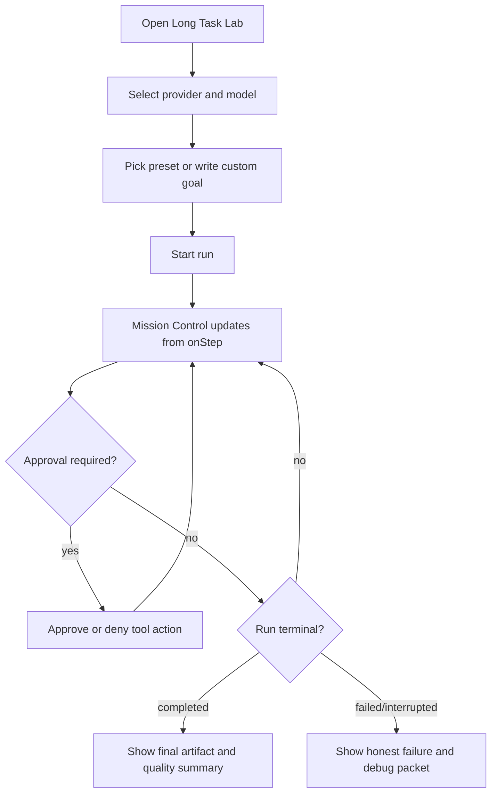

# Long Task Lab Demo Design

## Purpose

Long Task Lab is a new example websystem for demonstrating that `agrun.js`
can run complex, multi-step frontend agent tasks with visible planning,
tool use, evidence gathering, workspace drafting, readiness checks, and
debug artifacts.

It is not another chatbox. The current `examples/browser` app is already
good for conversational QA. Long Task Lab should feel like an agent mission
control surface: one user goal goes in, a long-running task unfolds, and
the user can inspect why the result is trustworthy or why the run failed.

## Problem Statement

End users and engineers need a concrete demo proving that `agrun.js` can do
more than single-turn chat. Today the browser chatbox can test long tasks,
but the UX is conversation-shaped: progress, evidence, TodoState, virtual
workspace, terminal repair, and run budget are present mostly inside the
Inspector. That is good for developers, but weak for showing product value
to a non-runtime audience.

Long Task Lab solves this by making long-running execution the primary UI.

## Goals

- Show complex long-running work with OpenAI or Gemini provider settings.
- Make progress visible without reading raw JSON.
- Make debugging easy enough for an engineer during a live demo.
- Preserve the AI-first harness boundary: runtime exposes tools, facts,
  state, and contracts; AI owns planning, source choice, writing, and final
  readiness.
- Reuse existing `agrun.js` runtime contracts where possible instead of
  inventing a second integration layer.

## Non-goals

- Do not replace `examples/browser` chatbox.
- Do not add runtime-owned report writing, hardcoded queries, or prompt-specific
  business logic.
- Do not promise OpenAI-style server-side background execution in the MVP.
  The first version is browser-session long-run visibility, not durable
  execution across browser refresh, process crash, or week-long resume.
- Do not store API keys in generated bundles, task records, debug exports,
  or committed files.
- Do not build a backend service unless a later phase needs server-auth,
  durable queueing, or hosted demo sharing.

## Product Positioning

Working name: `agrun Long Task Lab`.

Primary message:

> Give agrun.js a complex goal and watch the harness turn it into observable
> planning, tool calls, evidence, workspace artifacts, and a final deliverable.

Target users:

| User | Job to be done | Needs |
|---|---|---|
| End user / buyer | Understand whether agrun can complete complex tasks | Simple progress, final output, source confidence |
| Developer | Debug why a long run failed or looped | Step timeline, runState facts, support packet |
| Product / solution owner | Demo AI-first agent workflow safely | Presets, clean visuals, explainable states |

Success metrics for the demo:

- A first-time viewer can explain what the agent is doing within 60 seconds.
- A developer can identify the latest action, source count, TodoState status,
  workspace candidate status, and failure reason without opening raw JSON.
- A real OpenAI or Gemini run can complete one approved long-task preset or
  fail with an honest, actionable reason.
- The final artifact can be copied without internal debug labels.

## External Design Inputs

- OpenAI background mode separates long-running tasks from a fragile open
  connection using create/poll/cancel/stream-cursor semantics. The MVP should
  borrow the UX vocabulary of status, polling, cancel, and resumable cursor,
  but not claim server-side durability until implemented.
  Source: <https://developers.openai.com/api/docs/guides/background>
- Gemini long context supports large-context use cases and function calling.
  Long Task Lab should make model/provider choice visible, but keep the
  tool-call loop owned by `agrun.js`.
  Sources: <https://ai.google.dev/gemini-api/docs/long-context>,
  <https://ai.google.dev/gemini-api/docs/function-calling>
- LangGraph positions long-running agents around durable execution,
  streaming, human-in-the-loop, state, and traceability. Long Task Lab should
  emphasize those same user-visible capabilities where agrun already has
  browser-safe equivalents: sessions, approval, `onStep`, TodoState, evidence,
  virtual workspace, and debug snapshots.
  Source: <https://docs.langchain.com/oss/python/langgraph/overview>
- OpenTelemetry GenAI conventions warn that model inputs and outputs can be
  large and sensitive; production telemetry should not capture full content by
  default. Long Task Lab debug exports must stay redacted by default.
  Source: <https://opentelemetry.io/docs/specs/semconv/gen-ai/gen-ai-spans/>

## MVP Scope

Build a new example app under:

```text
examples/long-task-lab/
```

MVP screens:

1. Task Setup
2. Mission Control
3. Evidence & Workspace
4. Final Artifact
5. Debug Packet

MVP runtime path:

```text
User prompt preset/custom input
-> provider request through agrun session.run()
-> onStep/onToken streaming
-> derived mission state
-> evidence/workspace/debug panels
-> final artifact or honest failure state
```

MVP presets:

| Preset | Purpose | Suggested acceptance |
|---|---|---|
| Market Research Report | Demonstrate web_search + read_url + evidence synthesis | At least 3 source reads, final memo with links |
| Vendor Comparison Memo | Demonstrate structured comparison and final artifact | Comparison table + recommendation |
| Debug Investigation | Demonstrate failure/recovery visibility | Hypotheses, checks, and next actions |

Each preset must be editable before run. Presets are UI examples only; they
must not become runtime special cases.

## Future Phases

| Phase | Capability | Trigger |
|---|---|---|
| MVP | Browser-session long task lab | Prove UI and runtime integration |
| Phase 2 | Run archive and compare runs | Need side-by-side demo evidence |
| Phase 3 | Resume-after-refresh / durable local run state | Demo requires refresh/crash survival |
| Phase 4 | Server-auth hosted demo | Need customer-safe hosted deployment |
| Phase 5 | OpenAI background/queue adapter | Need true server-side background execution |

## User Flow



## Information Architecture

### Task Setup Panel

Controls:

- Provider segmented control: OpenAI / Gemini / Custom OpenAI-compatible.
- Model input with current default.
- API key input or inherited `.env.local` auto-seed indicator for local dev.
- OpenAI reasoning effort and Gemini thinking level controls for provider-specific
  latency/quality experiments.
- Test connection button that sends a minimal provider ping request and expects a
  `pong` reply before the user starts a long run.
- Read URL endpoint/key status.
- Web search endpoint status.
- Auto-approve tier-1 toggle for demo runs.
- Max steps selector, default aligned with current browser runtime (`80`).
- Prompt preset selector.
- Prompt editor.
- Start, Stop, Reset Run.

Validation:

- Provider requires model and API key unless server-auth/custom proxy mode is configured.
- Test connection validates provider key/model/custom endpoint first, then reports
  success, warning, or failure with elapsed time and the short provider reply.
- Search/read URL warnings are visible before run when a preset expects sources.
- Stop is enabled only while run is executing.

### Mission Control Panel

Purpose: show the current state without raw JSON.

Fields:

- Run status: idle, preparing, executing, blocked, completed, failed, interrupted.
- Runtime phase and OODAE cycle count.
- Step count / max steps.
- Latest action name and status.
- TodoState progress: active item, completed/pending counts.
- Terminal repair / convergence status when active.
- Token usage and cost ledger when available.

### Evidence Panel

Fields:

- Search queries used.
- Read URL list with status, title, URL, source quality, and relevance.
- Strong/usable source counts.
- Evidence gaps from research acceptance / requirement recovery.
- Failed source reads with recovery reason.

### Workspace Panel

Fields:

- Virtual workspace file list.
- Current final candidate path.
- Candidate stats: words, chars, CJK chars when available.
- Structure audit result.
- Latest workspace operation.
- Publish protocol state: missing finalize/read/publish or satisfied.

### Final Artifact Panel

Fields:

- Clean final output.
- Copy final.
- Copy sources.
- Quality summary:
  - terminalizedBy
  - finalAnswerSource
  - source minimum status
  - structure status
  - length/status facts
  - readiness decision

### Debug Packet Panel

Fields:

- Copy Support Packet.
- Copy Inspector JSON.
- Copy compact run summary.
- Redaction status.
- Raw tab hidden behind explicit expand.

Default behavior: show summarized debug first, raw JSON second.

## Runtime Integration Design

Prefer extracting shared adapter logic only after the new app proves the shape.
The first implementation can import from `src/index.js` directly, following
the current browser example pattern.

Target runtime integration:

```ts
const runtime = createRuntime({
  skills: [
    openaiBrowserSkill,
    geminiBrowserSkill,
  ],
  actionPolicy,
  defaultRunOptions: {
    plannerDirectives: [
      "For substantial long-running reports, inspect available agent skills before finalizing.",
    ],
  },
  maxSteps,
  sessionStore,
});
```

Use `session.run(...)`, not stateless `runtime.run(...)`, so multi-step
continuity and thread state are observable.

Run options:

- `onStep`: update mission timeline, evidence, workspace, TodoState, debug.
- `onToken`: update live final/draft text only when available.
- `disabledActions`: reflect missing read URL or web search setup.
- `plannerDirectives`: only demo-level guidance; no report content hardcoding.
- `AbortController`: stop run from UI.

## State Model

Host state:

```ts
type LabRun = {
  id: string;
  status: "idle" | "preparing" | "executing" | "blocked" | "completed" | "failed" | "interrupted";
  provider: "openai" | "gemini" | "custom";
  model: string;
  prompt: string;
  startedAt: number;
  endedAt?: number;
  agrunSessionId?: string | null;
  runId?: string | null;
  steps: LabStep[];
  todoState?: unknown;
  evidence?: LabEvidenceSummary;
  workspace?: LabWorkspaceSummary;
  finalArtifact?: string;
  debug?: MessageDebugSnapshot;
};
```

Persist only local demo state in browser storage. Never persist API keys inside
run records or debug packets.

## Security and Privacy

- API keys stay in settings storage following existing browser demo conventions.
- Debug exports must redact known secret fields and should not include raw API
  keys, auth headers, or bearer tokens.
- Raw prompt/output content is allowed in local demo debug only because the
  user is actively running the task. If a hosted production demo is later built,
  add explicit opt-in before exporting full content.
- Do not send debug packets to any backend in MVP.

## Observability Model

Long Task Lab should translate existing runtime state into user-readable cards.

| Runtime signal | UI surface |
|---|---|
| `steps[]` | Mission timeline |
| `runState.status` | Run status badge |
| `runState.cycleCount` / `maxSteps` | Budget meter |
| `todoState` | Task progress rail |
| `researchContext.readSources` | Evidence panel |
| `researchAcceptanceEvaluator` | Evidence quality summary |
| `virtualWorkspace` | Workspace panel |
| `terminalRepairState` | Repair status card |
| `actionPatternConvergence` | Loop/convergence warning |
| `costLedger` / provider usage | Token/cost panel |

## UX Principles

- The first screen must be the actual task lab, not a marketing landing page.
- Use dense operational layout: controls left, execution center, facts right.
- Use tabs or segmented controls for Evidence / Workspace / Debug instead of
  stacking every detail vertically.
- Keep end-user text clean; internal state names belong in debug labels.
- Failed runs must be honest and useful: show cause, last productive action,
  remaining gaps, and suggested next run adjustment.

## File Plan

Initial files:

```text
examples/long-task-lab/
├── index.html
├── package.json
├── tsconfig.json
├── vite.config.ts
└── src/
    ├── App.tsx
    ├── main.tsx
    ├── index.css
    ├── runtime/
    │   ├── lab-runner.ts
    │   ├── lab-state.ts
    │   ├── lab-debug.ts
    │   └── lab-presets.ts
    └── components/
        ├── TaskSetupPanel.tsx
        ├── MissionControlPanel.tsx
        ├── TimelinePanel.tsx
        ├── EvidencePanel.tsx
        ├── WorkspacePanel.tsx
        ├── FinalArtifactPanel.tsx
        └── DebugPacketPanel.tsx
```

Build integration after MVP:

- Add `npm --prefix examples/long-task-lab run build`.
- Decide whether root `npm run build` should copy it into `dist/long-task-lab/`
  or keep it as a development-only example until stable.

Recommended release path:

1. Build MVP outside root `dist`.
2. Verify with real OpenAI/Gemini.
3. Add root build/copy step only after the demo is stable and leak-guarded.

## Test Plan

Unit/smoke:

- Preset generation returns editable prompt strings.
- Debug summarizer redacts key-like fields.
- Step mapper converts runtime steps into mission timeline rows.
- Evidence mapper handles empty, partial, failed, and successful source states.
- Workspace mapper handles missing/empty/drafted/ready candidate states.

Browser QA:

- Load app with no keys: setup warnings visible, Start disabled or guarded.
- Load with mock settings: task can start and stop.
- Real provider run with auto-approve off: approval card appears for search/read.
- Real provider run with auto-approve on: run progresses without approval clicks.
- Failed/maxSteps run shows actionable HBR instead of generic failure.
- Completed run shows final artifact and copy buttons.
- No console errors in desktop and mobile viewport.

Real API gates:

- OpenAI: one preset reaches terminal completed or honest limited/failure with
  evidence/debug visible.
- Gemini: one preset reaches terminal completed or honest limited/failure with
  evidence/debug visible.
- Debug packet contains no API key literals from `.env.local`.

## Acceptance Criteria

The Step 2 implementation is ready when:

- `examples/long-task-lab` runs locally with Vite.
- A user can choose provider/model, edit a preset prompt, and start a run.
- Mission Control updates live from `onStep`.
- Stop interrupts a run and records an interrupted state.
- Evidence, TodoState, workspace, and final artifact are visible without raw JSON.
- Debug packet copy works and is redacted.
- At least one real API run is recorded in `agrun_docs/live-tests/`.
- `task.md` and `task.jsonl` track the implementation result and HBR.

## Risks and Mitigations

| Risk | Impact | Mitigation |
|---|---|---|
| Duplicate browser demo integration code | Maintenance cost | Start local; extract shared adapter only after the second app proves stable |
| Long runs burn tokens | Cost and slow QA | Presets include short/medium/long variants; default to medium |
| Model fails before final artifact | Demo looks bad | Treat honest failure as a product feature with visible HBR and next run suggestion |
| API key leakage in dist | Security issue | Reuse secret guard pattern before adding to root dist |
| UI overwhelms end user | Weak demo | Summary-first panels, raw JSON behind expand |
| Runtime lacks true background durability | Overpromising | Label MVP as browser-session long-run lab; defer durable background mode |

## Open Decisions

- Should Long Task Lab share provider settings with `examples/browser`, or keep
  separate local storage to avoid test cross-contamination?
- Should MVP import helper code from `examples/browser/src/runtime`, or should
  we first copy the minimum and refactor shared code later?
- Should `dist/` eventually include `dist/long-task-lab/`, or should this stay
  source-only until the demo is stable?
- Which real provider/model pair is the canonical demo path: OpenAI envelope
  or Gemini envelope?

## Implementation Status — 2026-05-17

Step 2 MVP has been scaffolded under `examples/long-task-lab`.

Implemented files:

```text
examples/long-task-lab/
├── index.html
├── package.json
├── tsconfig.json
├── vite.config.ts
├── test/lab-state.smoke.ts
└── src/
    ├── App.tsx
    ├── index.css
    ├── main.tsx
    ├── runtime/
    │   ├── lab-runner.ts
    │   ├── lab-state.ts
    │   ├── lab-debug.ts
    │   └── lab-presets.ts
    └── components/
        ├── TaskSetupPanel.tsx
        ├── MissionControlPanel.tsx
        ├── TimelinePanel.tsx
        ├── EvidencePanel.tsx
        ├── WorkspacePanel.tsx
        ├── FinalArtifactPanel.tsx
        └── DebugPacketPanel.tsx
```

Root helper scripts:

```text
npm run test:long-task-lab
npm run build:long-task-lab
```

MVP behavior now available:

- Provider/model/key setup for OpenAI, Gemini, and custom OpenAI-compatible
  endpoints.
- Provider connection test in Settings: sends `Connection test. Reply exactly
  with this lowercase word and no extra text: pong`, uses the selected provider
  settings, reports elapsed time, and does not write a run record.
- Editable presets and prompt editor.
- `session.run(...)` integration with `onStep` timeline updates and `onToken`
  draft text.
- Stop via `AbortController`.
- Mission Control summary for status, runtime step count, latest action,
  TodoState progress, and repair/publish status.
- Evidence, Workspace, Final Artifact, and Debug Packet tabs.
- Redacted debug packet copy.
- `.env.local` auto-seeding only in Vite dev mode; production build does not
  embed local API keys.

Verification recorded:

- `npm run test:long-task-lab` passed.
- `npm run build:long-task-lab` passed with only the known large bundle warning.
- Chrome DevTools local smoke at `http://localhost:3001/` verified setup,
  Mission Control, Timeline, Final Artifact, Evidence/Workspace/Debug tab
  switching, no horizontal overflow at the inspected desktop viewport, and no
  captured JS errors.
- Real OpenAI run completed a short Long Task Lab smoke mission. It produced a
  final artifact, populated Evidence/Debug state, and surfaced weak evidence
  honestly because the only direct read was blocked.
  See [live-tests/long-task-lab-mvp-2026-05-17.md](./live-tests/long-task-lab-mvp-2026-05-17.md).

Known gaps / HBR:

- Approval resume UI is not implemented yet. With auto-approve off, the runtime
  can block on policy and the app now reports that blocked state honestly, but
  it does not yet render Approve/Deny controls or call `resumeApproval`.
- The first verified real run had `usable=0` and `strong=0` because the direct
  source read hit a challenge page. This validates honest weak-evidence
  surfacing, not strong report quality.
- Long Task Lab is now included in the root release distribution through
  `npm run build`, which builds the app and copies it into
  `dist/long-task-lab/` with the same secret-leakage guard used for the browser
  example. `examples/long-task-lab/dist/` remains a local build output, while
  `dist/long-task-lab/` is the committed handoff artifact.
- Browser QA used Chrome DevTools because the in-app Browser Node control tool
  was unavailable in this session; mobile layout was covered by responsive CSS
  rules and build checks but not by a rendered mobile screenshot.

## Recommended Next Step

Add approval resume controls:

1. Surface `runState.pendingApproval` in a dedicated approval card.
2. Keep the active runtime/session handle available while blocked.
3. Wire Approve/Deny to `session.resumeApproval(...)`.
4. Add a smoke test for blocked → approved → continued execution.
