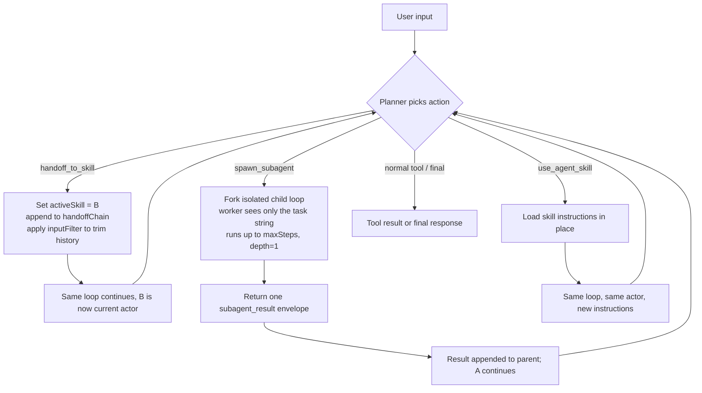

# Multi-Agent Orchestration in agrun

Last reviewed: 2026-06-03

Audience: integrators and engineers who want to know how agrun runs "more than one
agent" in a single browser session, and how that compares to other agent SDKs.

For the single-agent loop, see `agrun_docs/agentic-execution-flow.md`.
For the planner contract, see `agrun_docs/action-contract.md` and
`agrun_docs/planner-architecture.md`.

## One Sentence

Multi-agent in agrun is **one session loop whose "current actor" can change** — the
AI planner picks one of three explicit actions to transfer, delegate, or re-equip the
active agent, and each action carries its own safety boundary.

## The Core Idea (same as every agent SDK)

Every agent SDK reduces to:

```text
loop {
  out = currentAgent.model(context, tools)
  if (out is tool)     { run tool; append result; continue }
  if (out is "switch") { change currentAgent; continue }   // ← multi-agent lives here
  if (out is final)    { return out }
}
```

"Multi-agent" is **not** many parallel loops. It is a single loop where
`currentAgent` is a swappable variable. The frameworks differ only in *how* the swap
happens and *what context the new actor sees*.

## agrun's Three Mechanisms

agrun does not have one generic "handoff". It splits the swap into **three actions
with distinct semantics**, so a weak model does not have to infer intent — the action
name + planner guidance disambiguate it.

| Action | Semantic | Control transfer | Loops | ADR / source |
|---|---|---|---|---|
| `handoff_to_skill` | **Transfer (handoff)** — phase boundary, hand the wheel to skill B | Yes, A exits | Same session loop | [ADR-0043](./adr/0043-handoff-to-skill.md), `src/runtime/actions/handoff-to-skill-action.js` |
| `spawn_subagent` | **Delegate (agent-as-tool)** — give a worker a self-contained task, get one string back | No, A keeps the wheel | Forks an isolated child loop (`depth=1`) | [ADR-0037](./adr/0037-spawn-subagent-orchestrator-worker.md), `src/runtime/actions/spawn-subagent-action.js` |
| `use_agent_skill` | **Re-equip** — load a skill's instructions without a phase-boundary signal | No, same actor | Same loop, no handoff semantics | `src/runtime/actions/use-agent-skill-action.js` |

### When the planner should pick which

- **Phase changes, next phase needs different instructions** → `handoff_to_skill`
  (e.g. research done → implement). A is finished; B owns the conversation now.
- **Independent, read-mostly sub-task, parent history already long** → `spawn_subagent`
  (e.g. "look up today's date", "summarize one URL"). A stays in charge; the worker is
  isolated so it cannot see — or pollute — the parent's TodoState/workspace/history.
- **Just need another skill's instructions mid-flow, no clean phase break** →
  `use_agent_skill`.

The disambiguation rule lives in each action's planner `guidance` string. Keeping that
wording crisp is what lets weak models route correctly — see
`agrun_docs/harness-engineering-principles.md`.

## Flow



## Safety Boundaries (where agrun goes finer than a bare `max_turns`)

1. **Handoff cycle detection** — `src/runtime/handoff-chain.js` records the chain of
   skills (`handoffChain`). If a handoff would revisit a skill already in the chain
   (A→B→A), `detectHandoffCycle` blocks it with `HANDOFF_CYCLE_DETECTED` and the
   control resolves to `complete` instead of looping forever. This is targeted cycle
   prevention, not a blunt turn cap.

2. **Handoff input filtering** — `src/runtime/handoff-input-filter.js` lets the host
   (or the planner's `inputFilter` arg) trim what the receiving skill sees, e.g.
   `{ actionHistory: { keepLast: 3 }, toolHistory: { keepLast: 0 } }`. Purpose:
   protect the receiving agent's **attention budget** — see
   `agrun_docs/context-attention-budget-and-subagents.md`. This is agrun's analogue of
   the OpenAI Agents SDK `call_model_input_filter`.

3. **Subagent isolation** — the worker runs `depth=1` (cannot recurse), must declare
   the exact `tools` it needs (declared tools auto-approved, undeclared blocked), and
   returns a single `subagent_result` envelope with `finalResponse`. The parent's
   history therefore stays slim regardless of how much work the worker did. The fork
   is **serial** (the parent awaits the worker), not concurrent — correct for the
   browser's single thread.

## Resolved — `spawn_subagent` empty `finalResponse` root cause (AGRUN-296, 2026-06-04)

The "child reached finalize but returned empty `finalResponse`" symptom was **not** a
Gemini empty-completion problem. Root cause (ADR-0049): `normalizeChildResult` read the
child answer with `readString(childResult.output)`, but `runLoop` returns `output` as a
terminal **object** `{ kind, text, … }` — `readString` of an object is `""`, so every
`finalize`-path child's answer was discarded and demoted to `SUBAGENT_EMPTY_RESPONSE`,
no matter what the finalizer produced. Fix: extract `output.text` for the
`final_response`/`planner_final` terminal kinds (kind-guarded so a blocked child's
`approval_required.text` cannot leak as an answer), with string + `lastPlannerFinalText`
fallbacks. AGRUN-261's demotion is preserved for genuinely empty children. Parent-side
contract for `SUBAGENT_EMPTY_RESPONSE` (re-delegate / answer inline / report the gap —
never fabricate) is documented; no hardcoded fallback text. Verified by deterministic
unit tests + `gemini-3.1-flash-lite` real-LLM e2e (parent relayed the worker's `PONG`).
See `agrun_docs/adr/0049-spawn-subagent-empty-finalresponse-root-cause.md` and
`agrun_docs/context-attention-budget-and-subagents.md`.

## Comparison to Other SDKs (same loop layer)

| | OpenAI Agents SDK | LangGraph | Strands | **agrun** |
|---|---|---|---|---|
| Transfer | `handoff` | supervisor→worker edge | swarm peer transfer | `handoff_to_skill` |
| Delegate | agent-as-tool | sub-graph node | tool-wrapped agent | `spawn_subagent` |
| Loop guard | `max_turns` | graph `END` / recursion limit | model stops calling | cycle detection + `max_turns` + `maxSteps` |
| Context handoff | `call_model_input_filter` | shared state / checkpoint | session | `inputFilter` (named or declarative) |
| Runs in | server (Python) | server | server | **browser front-end** |

Note: **AWS Bedrock AgentCore is not on this table** — it is a hosting/ops platform
(serverless Runtime, Memory, Gateway, Identity, Observability), not an agent loop. It
hosts agents written in the SDKs above; agrun is the loop layer, not a competitor to
AgentCore.

## Subagent Isolation Audit (2026-06-03)

Question audited: can a `spawn_subagent` worker accidentally see the parent's
TodoState / context / history?

**Verdict: one confirmed leak found and FIXED (2026-06-03), plus latent fragility
hardened.** Most agent state is never carried on `options`, so the
`{ ...parentOptions }` spread in `buildChildOptions` cannot leak it — but
`threadHydration` (and `turnIntent`) WERE carried and WERE leaking. See "Confirmed
leak" below.

The fields that never leak (never on `options`):

| Parent state | How it is produced | Child sees it? |
|---|---|---|
| `runState` | `createRunState(runId, …)` keyed on **runId** | No — child has `childRunId`, fresh |
| `TodoState` | `maybeAutostartTodoState` from session/input | No — child rawInput is the clean task |
| `contextSnapshot` / `researchContext` / `actionHistory` | built inside `runActionLoop` from the fresh runState | No — not on `options` |
| `rawInput` (prompt/history) | rebuilt via `CHILD_RAW_INPUT_ALLOWLIST` (provider/network fields only) | No |
| `request` / `normalizedInput` | child sets `undefined` → recomputed | No |
| events (`onStep`, `onStreamEvent`, …) | child sets `undefined` | No — child events stay in child ledger |

Defense in depth (all driven by real e2e incidents recorded in
`spawn-subagent-capability.js`): `depth=1` (spawn disabled for child, double-guarded
via disabledActions + runtimeConfig), `maxSteps` clamped to the parent ceiling,
rawInput allowlist (prevents the approval-resume recursion bomb that froze the tab),
and `tools:[...]` as a pre-approval contract where **host `deny` is never overridden**.

### Confirmed leak — FIXED 2026-06-03

`threadHydration` was a **real, present leak**, not merely latent:
1. `src/session/handle.js` sets `threadHydration` (and `turnIntent`) on the run options.
2. `threadHydration` carries the active thread's **`todoState` + `researchContext`**
   (see `hydrateRunStateWithThread` in `src/runtime/run-state-thread.js`).
3. The child has no `runState`, so `createActionLoopSession` calls
   `hydrateRunStateWithThread(childRunState, options.threadHydration)` — seeding the
   worker's fresh runState with the **parent thread's TodoState and research sources**.

So the worker genuinely inherited the parent's TodoState — the exact failure the audit
asked about. Fix: `buildChildOptions` now spreads a `blankParentRunState()` map that
sets `threadHydration`, `turnIntent`, and the whole parent run-state category
(`runState`, `todoState`, `contextSnapshot`, `sessionContext`, `researchContext`,
`actionHistory`, `steps`, `pushStep`, `availableActions`, `plannerActions`, …) to
`undefined` **before** the explicit overrides. Guarded by regression Test 18 in
`test/unit/spawn-subagent-capability.test.js`.

### Posture note — why a blank-list, not a full allowlist

The audit's ideal was a `CHILD_OPTIONS_ALLOWLIST` (default-deny). That was **evaluated
and rejected on evidence**: the child's option consumption is sprawling (~30+ piecemeal
`options.X` reads across `action-loop-session.js` / `run-loop.js` / `approval.js` /
finalize), so an allowlist would silently break the child if one infra field were
missed — and there is no real-runLoop child test in CI that would catch it. The chosen
posture is an explicit **blank-list of exactly the parent run-state category**
(default-deny *for state*, inherit infra), guarded by a regression test that fails if
any of those keys reach the child. `runtimeEventBus` / `sessionStore` / `storage`
remain shared via the spread — an observability concern (child events distinguished
only by lineage tags), not a context leak.

## Planner Guidance Easy-to-Confuse Audit (2026-06-03)

Benchmarked against the OpenAI Agents SDK, which bakes the routing cue into the tool
**name** (`transfer_to_X`), an appended `handoff_description`, and a
`RECOMMENDED_PROMPT_PREFIX` in the agent instructions. agrun routes via guidance
strings + aliases. The `handoff ↔ spawn` contrast is explicit and good; three
confusion risks remain for weak models:

1. **`delegate` word collision (concrete).** `spawn_subagent` aliases are
   `["delegate", "worker", "subagent"]` and its description says "**Delegate** a
   focused sub-task", while `handoff_to_skill` aliases include `delegate_to_skill`.
   A weak model wanting to "delegate to the coder skill" may fire `delegate_to_skill`
   (= handoff, control transfers, caller exits) when it meant a worker that returns.
2. **`handoff_to_skill ↔ use_agent_skill` not cross-referenced (biggest gap).** Both
   mean "switch to skill X". handoff guidance only warns against `spawn_subagent`;
   `use_agent_skill` guidance never mentions handoff. The subtle distinction (phase
   boundary + control transfer vs merely keeping instructions active) is never
   contrasted in either string — the `handoff ↔ use_skill` edge of the triangle is
   missing.
3. **Precondition asymmetry unsurfaced.** `use_agent_skill` requires a prior
   `read_agent_skill` ("only after read_agent_skill"; `lastReadSkill` null otherwise),
   while `handoff_to_skill` does its own bundled+provider lookup and needs no read.
   Neither guidance states this, so a weak model may over-`read` before handoff or
   call `use_agent_skill` with no prior read and fail.

Fixes — APPLIED 2026-06-03 (AI-facing wording only — contracts, not runtime decisions,
per the AI-first rule):
- (a) `handoff_to_skill` guidance now ends with "Do NOT confuse with use_agent_skill,
  which only activates a skill's instructions in place WITHOUT transferring control or
  starting a new phase"; `use_agent_skill` guidance now says it "does NOT transfer
  control or start a new phase. To hand the wheel … use handoff_to_skill instead" —
  closing the `handoff ↔ use_skill` triangle edge.
- (b) `delegate_to_skill` removed from `handoff_to_skill` aliases (now
  `["transfer_to_skill", "switch_skill"]`), so the verb root "delegate" maps only to
  `spawn_subagent`. Verified no test/host referenced the removed alias.
- (c) `use_agent_skill` guidance now states the `read_agent_skill` precondition
  explicitly ("it activates the LAST-read skill, so without a prior read there is
  nothing to activate") and notes that `handoff_to_skill` needs no prior read.

## Key Takeaway

Multi-agent = **one loop + a swappable actor + a safety valve per swap kind**. agrun's
contribution is making the three swap kinds *explicit named actions* (so weak models
route correctly) and giving each its own guard (cycle detection, attention-budget
filtering, depth/tool isolation), rather than relying on one generic handoff plus a
turn cap.
